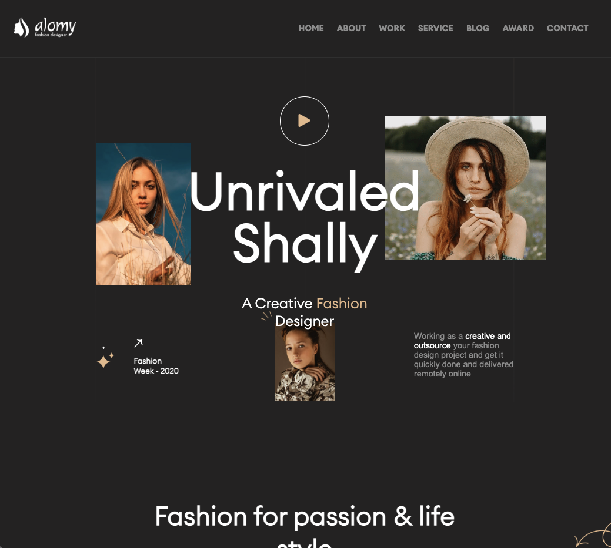

# Bootcamp Exercise - Fashion for Passion

## Table of contents

- [Overview](#overview)
  - [The challenge](#the-challenge)
  - [Screenshot](#screenshot)
  - [Links](#links)
- [My process](#my-process)
  - [Built with](#built-with)
  - [What I learned](#what-i-learned)

## Overview

### The challenge

Users should be able to:

- Redesign a Figma Prototype

### Screenshot

### Links

- Solution URL: [https://borisd2023.github.io/Fashion-for-Passion/]

## My process

### Built with

- Semantic HTML5 markup
- Grid
- Flexbox
- Animations CSS
